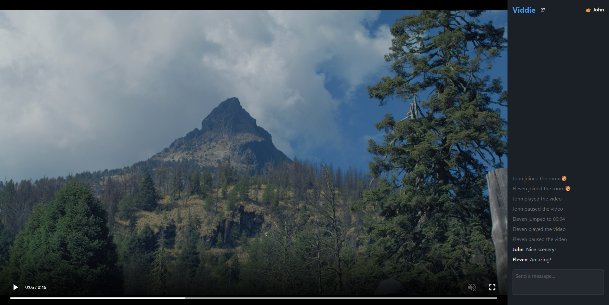
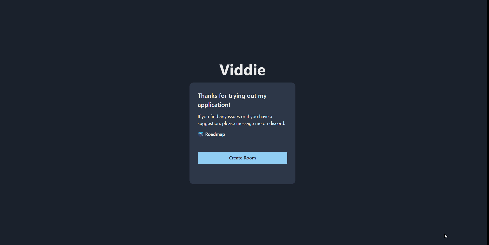

# Viddie

[Viddie](https://viddie-alpha.netlify.com) is a watch party web application that synchronizes user's local video file on the browser. 

## Creating a Room Demo

## About the Project

 Viddie allows users to create watch party rooms to synchronize and match their local video file with other users. Users joining a room must have the same file of the room host in order to join. The application verifies the size and length of the video file but room hosts may force checking the file's checksum before joining. The video file users select must be playable in the browser for the application to work properly.

### Features

 - Create rooms that synchronizes the playback of a local video file
 - Sync plays, pauses, and seeks to all users in a room
 - Hash video files before creating / joining a room
 - Text chat

### Built with

 - React
 - Typescript
 - Node.js
 - Socket.IO
 - Chakra UI

### Current Limitations
The application currently only allows the **MPEG-4 video file format**.

## Quick Start
This project was bootstrapped with create-react-app. The server code is made with Node.js and is located in the server folder.

### React Frontend
 - Install npm dependcies of the React app in the root directory of the repo with `npm install`.
 - Create .env file by copying the .env.example file.
 - Start the react application with `npm start`.

 ### Node Backend
 - Change directory to the server directory  example: `cd server`.
 - Install npm dependencies of the server with `npm install`.
 - Start the server with `npm run serve` while in the server directory.

## Roadmap
View the project roadmap hosted in Notion [here](https://volume-internet-destination-durock-elementary.notion.site/Roadmap-ef7c028132274b49b84f6a0df1531719).

## License

Distributed under the MIT License. See `LICENSE` for more information.